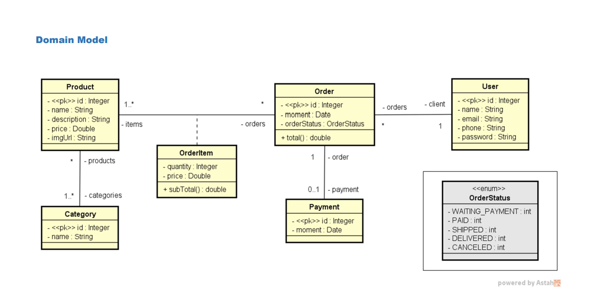

# Projeto SpringBoot E-commerce


Esse projeto representa uma simples estrutura de um sistema de e-commerce. Ele foi contruído utilizando Java, Spring Boot, Spring JPA, Spring Hateoas, H2database como banco de dados em memória para desenvolvimento e Postman para testar as requisições. 

Esse sistema foi desenvolvido pelo professor Nelio Alves durante o curso de Java Completo oferecido pela plataforma de Udemy.
Ele tem o objetivo de testar os conhecimentos aprendidos durante o desenvolvimento do curso.

## Instalação
1. Clone o repositório: 
```bash
git clone http://github.com/mclara831/project-springboot-jpa
```
2. Instale as dependências do Maven.

## Utilização 
1. Inicie a aplicação.
2. As API's podem ser acessadas em http://localhost:8080

## Modelo de domínio


## EndPoints

### Users
```bash
GET /users - retorna todos os usuários registrados.

POST /users/save - registra um novo usuário.

UPDATE /users/{id} - atualiza os dados do usuario fornecido pelo id.

DELETE /users/{id} - deleta o usuário.
```
### Orders
```bash
GET /users - retorna todos os pedidos registrados.

GET /users/{id} - retorna o pedido fornecido pelo id.
```

### Produtos
```bash
GET /users - retorna todos os produtos registrados.

GET /users/{id} - retorna o produto fornecido pelo id.
```

### Categorias
```bash
GET /users - retorna todas as categorias registradas.

GET /users/{id} - retorna a categoria fornecida pelo id.
```
## Postman
Os testes da API foram realizados utilizando o Postman.

Baixe e instale o Postman a partir do [site oficial](https://www.postman.com/).
